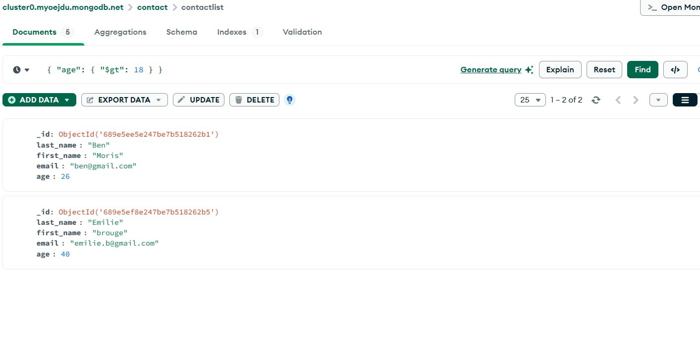

# Checkpoint MongoDB

This project demonstrates basic MongoDB CRUD operations using MongoDB Compass.

## Steps:

1. **Create database Insert documents Display all contacts**
2. **Find by ID**
3. **Find contacts with age > 18**
4. **Find contacts with age > 18 and name containing "ah"**
5. **Update first name from "Kefi Seif" to "Kefi Anis"**
6. **Delete contacts aged < 5**
7. **Display all contacts again**

## Screenshots

